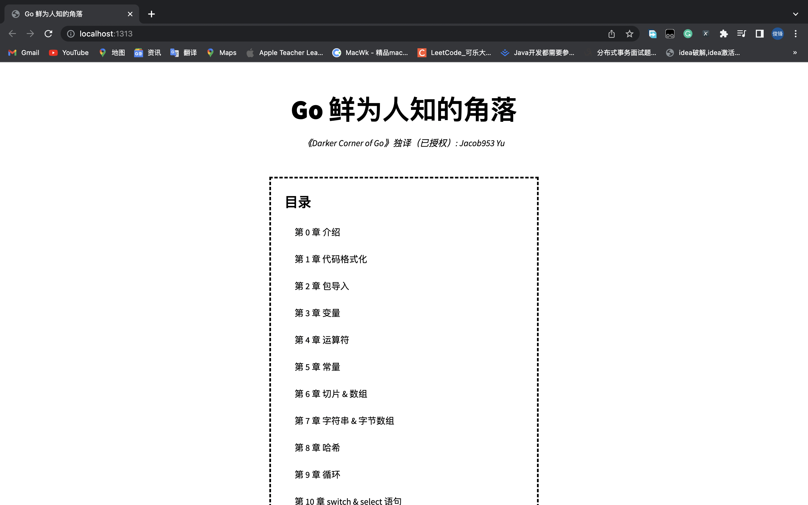

# Go 鲜为人知的角落

> 仓库性质：[《Darker Corners of Go》](https://rytisbiel.com/2021/03/06/darker-corners-of-go/)的中文译本（已授权）
> 
> 作者：[Rytis Bieliunas](https://rytisbiel.com/) 
> 
> 独译：[Jacob953 Yu](https://github.com/Jacob953)

## 介绍

在学习 Go 之初，我也硬着头皮去仔细阅读过《Effective Go》。但对于一个初学者来说，很难领会“圣经”中所表达的核心理念。
于是，我试着去阅读《Darker Corners of Go》，尽管它不是很典型的入门类型书籍，但它依然让我直观地感受到了 Go 语言的特性，还帮助我更快地锁定需要查阅的范围。
所以，我打算干脆将它用更加地道的方式翻译出来，直接分享给大家。

这本书是根据《Darker Corners of Go》的电子版翻译过来的，与网上的电子版有一定的差异，有些内容是电子版没有的，或许后续会更新上去。

实际上，在多年前，Kyle Quest 发布过一篇 "50 Shades of Go: Traps, Gotchas, and Common Mistakes for New Golang Devs"，当然，这篇文章也有中文译本。
那篇文章以难度高低的方式对陷阱进行分类，而《Go 鲜为人知的角落》以类型的方式对陷阱进行分类。对于一个经验不足的 Gopher 来说，我认为后者或许更易被接受和学习。

### 进度表

- [x] 翻译阶段——第一阶段：初步翻译，广征意见，详见 [知乎专栏](https://www.zhihu.com/column/c_1515125961956167680) & [掘金专栏](https://juejin.cn/column/7101233483212652581)
- [ ] 翻译阶段——第二阶段：反复斟酌，优化内容
- [ ] 正式上线
- [ ] 正式出版

## 如何开始

### 依赖

- Hugo 
- Go（可选）

### 构建

1. 安装依赖（以 macOS 为例，详细参考 [Install Hugo](https://gohugo.io/getting-started/installing/)）
    ```
    brew install hugo
    ```
2. 拉取仓库到本地（如果只考虑读）
    ```
    git clone git@github.com:Jacob953/darker-corners-of-go.git
    ```

### 运行

1. 进入仓库根目录
    ```
    cd darker-corners-of-go
    ```
2. 运行 hugo 渲染
    ```
    hugo server
    ```
3. 在浏览器中阅读，通常情况下：http://localhost:1313/

<p align="center">
    
</p>

## 关于

如果总结的例子中没有包括令你最意外的 Go 的用法，请联系 Rytis Biel：rytbiel@gmail.com

如果你发现译本中有撰写错误的地方，请联系 Jacob953 Yu：jacob953@csu.edu.cn

## 鸣谢

感谢 Rytis Bieliunas 先生，是他给予了我极大的信任，让我以独译的角色翻译这本书，并时刻关注译本的进度，同时也要感段桂华女士，在翻译筹备过程中，是她在背后给予了我很多支持。

## 许可证

仓库文章内容遵循 [CC BY-SA 4.0](licenses/LICENSE-CC)，仓库代码遵循 [MIT License](licenses/LICENSE-MIT)。
